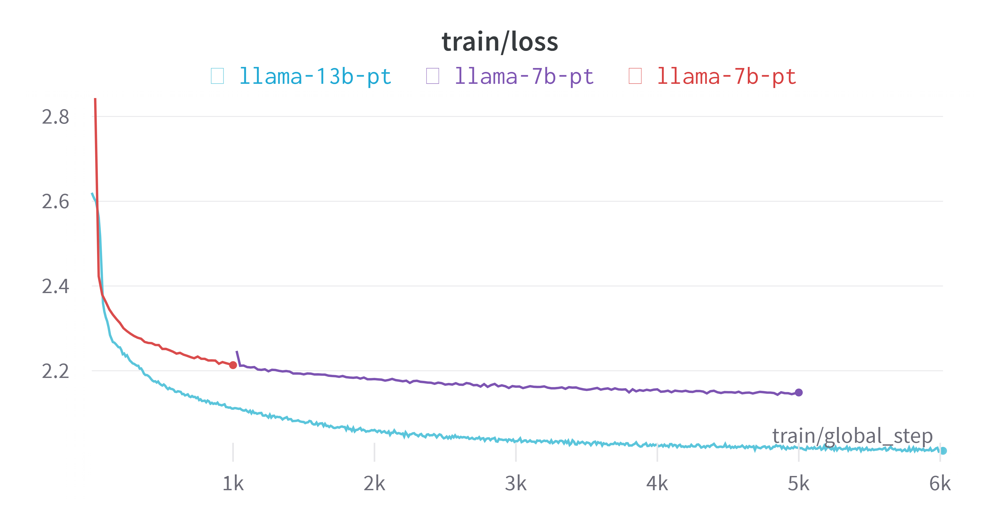

# Models

### Instruction-following Models and Chat Models

The fine-tuned 🦙 Vigogne models come in two types: **instruction-following models** and **chat models**. The instruction-following models are optimized to generate concise and helpful responses to user instructions, similar to `text-davinci-003`. Meanwhile, the chat models are designed for multi-turn dialogues, but they also perform well in instruction-following tasks, similar to `gpt-3.5-turbo`.

You can access the weights for these models on the 🤗 Hugging Face Hub. For further insights into the training data used, you can find additional details in the [vigogne/data](./data.md).

### Recommended Models

Here is a list of recommended models for this project. These models have been trained using more diverse and higher-quality data, along with an optimized training process. It is advisable to use these models as a priority for your project. For alternative models, please refer to the [Other Models](#other-models) section.

|                                     Model                                      | Type  |            Foundation model             |      Data      |                                                          Description                                                           |
| :----------------------------------------------------------------------------: | :---: | :-------------------------------------: | :------------: | :----------------------------------------------------------------------------------------------------------------------------: |
| [Vigogne-2-7B-Chat-V2.0](https://huggingface.co/bofenghuang/vigogne-2-7b-chat) | Chat  | [Llama-2-7B](https://ai.meta.com/llama) | 520K chat data | Check out our [blog](https://github.com/bofenghuang/vigogne/blob/main/blogs/2023-08-17-vigogne-chat-v2_0.md) for more details. |

### Legacy Models

Due to performance and licensing concerns, the models below are no longer recommended for general use. However, they could still be useful in specific scenarios.

|                                            Model                                            |         Type          |                             Foundation model                             |        Data        |    Description    |
| :-----------------------------------------------------------------------------------------: | :-------------------: | :----------------------------------------------------------------------: | :----------------: | :---------------: |
|  [Vigogne-2-7B-Chat-V1.0](https://huggingface.co/bofenghuang/vigogne-2-7b-chat/tree/v1.0)   |         Chat          |                 [Llama-2-7B](https://ai.meta.com/llama)                  |   420K chat data   |                   |
|            [Vigogne-7B-Chat](https://huggingface.co/bofenghuang/vigogne-7b-chat)            |         Chat          | [LLaMA-7B](https://ai.meta.com/blog/large-language-model-llama-meta-ai)  |   420K chat data   | Research use only |
|           [Vigogne-13B-Chat](https://huggingface.co/bofenghuang/vigogne-13b-chat)           |         Chat          | [LLaMA-13B](https://ai.meta.com/blog/large-language-model-llama-meta-ai) |   420K chat data   | Research use only |
|     [Vigogne-falcon-7B-Chat](https://huggingface.co/bofenghuang/vigogne-falcon-7b-chat)     |         Chat          |                  [Falcon-7B](https://falconllm.tii.ae)                   |   420K chat data   |                   |
|      [Vigogne-2-7B-Instruct](https://huggingface.co/bofenghuang/vigogne-2-7b-instruct)      | Instruction-following |                 [Llama-2-7B](https://ai.meta.com/llama)                  | 260K instruct data |                   |
|     [Vigogne-2-13B-Instruct](https://huggingface.co/bofenghuang/vigogne-2-13b-instruct)     | Instruction-following |                 [Llama-2-13B](https://ai.meta.com/llama)                 | 260K instruct data |                   |
|        [Vigogne-7B-Instruct](https://huggingface.co/bofenghuang/vigogne-7b-instruct)        | Instruction-following | [LLaMA-7B](https://ai.meta.com/blog/large-language-model-llama-meta-ai)  | 260K instruct data | Research use only |
|       [Vigogne-13B-Instruct](https://huggingface.co/bofenghuang/vigogne-13b-instruct)       | Instruction-following | [LLaMA-13B](https://ai.meta.com/blog/large-language-model-llama-meta-ai) | 260K instruct data | Research use only |
|       [Vigogne-33B-Instruct](https://huggingface.co/bofenghuang/vigogne-33b-instruct)       | Instruction-following | [LLaMA-33B](https://ai.meta.com/blog/large-language-model-llama-meta-ai) | 260K instruct data | Research use only |
| [Vigogne-Falcon-7B-Instruct](https://huggingface.co/bofenghuang/vigogne-falcon-7b-instruct) | Instruction-following |                  [Falcon-7B](https://falconllm.tii.ae)                   | 260K instruct data |                   |
|    [Vigogne-MPT-7B-Instruct](https://huggingface.co/bofenghuang/vigogne-mpt-7b-instruct)    | Instruction-following |              [MPT-7B](https://www.mosaicml.com/blog/mpt-7b)              | 260K instruct data |                   |
| [Vigogne-Bloom-7B1-Instruct](https://huggingface.co/bofenghuang/vigogne-bloom-7b1-instruct) | Instruction-following |         [BLOOM-7B1](https://huggingface.co/bigscience/bloom-7b1)         | 260K instruct data |                   |

### Pretrained Models

The majority of the training corpus used to train the original LLaMA model is in English. In this case, we have gathered a substantial amount of French corpus and used it to continue the pretraining process. This language adaptive pretraining will improve the model's performance when processing French data.

The training process is still ongoing since it is a computationally expensive task that requires significant resources.

