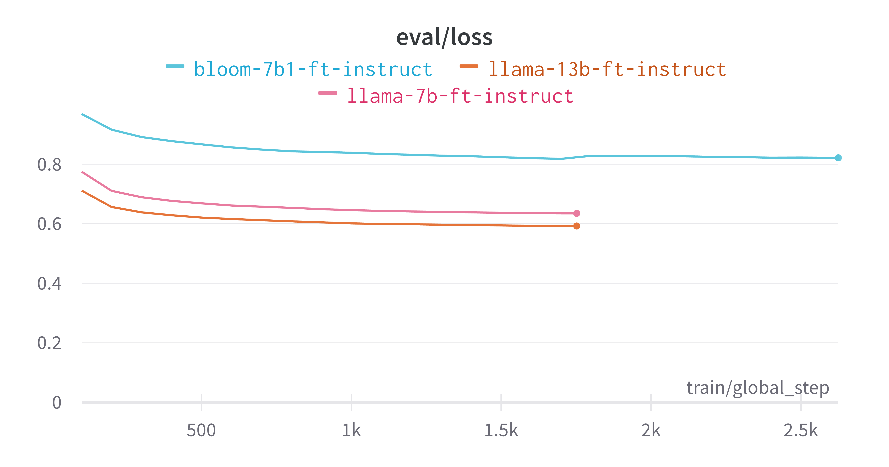
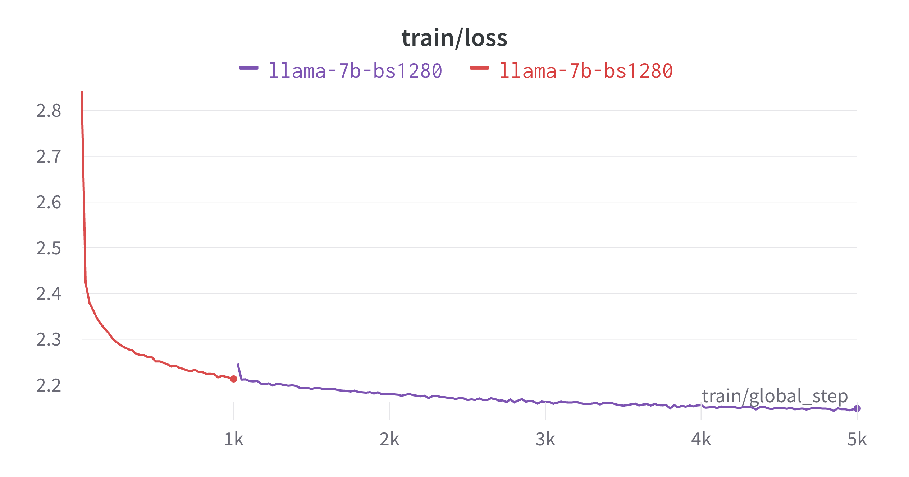

# Models

The fine-tuned 🦙 Vigogne models come in two types: **instruction-following models** and **chat models**. The instruction-following models are optimized to generate concise and helpful responses to user instructions, similar to `text-davinci-003`. Meanwhile, the chat models are designed for multi-turn dialogues, but they also perform well in instruction-following tasks, similar to `gpt-3.5-turbo`.

<!-- todo -->
**User Notice**: Facebook has not made the official LLaMA model weights open source, although various third-party download links are available online, such as `decapoda-research/llama-7b-hf` and `huggyllama/llama-7b` in the Hugging Face model library. It should be noted that the use of these links may not comply with Facebook's policies. Due to the reasons mentioned above, the project cannot release the complete weights of fine-tuned models. However, only the LoRA weights can be provided, which can be considered as a "patch" for the original LLaMA model.

### Instruction-following Models

The Vigogne-Instruct models were fine-tuned using instruction-following tasks. Additional details regarding the data are available in the [vigogne/data](../data/README.md).

The weights for the Vigogne-Instruct models can be found on the 🤗 Hugging Face Hub:

|                                            Model                                            |                              Description                               |
| :-----------------------------------------------------------------------------------------: | :--------------------------------------------------------------------: |
|        [vigogne-7b-instruct](https://huggingface.co/bofenghuang/vigogne-7b-instruct)        |          LLaMA-7B model fine-tuned for instruction-following           |
|       [vigogne-13b-instruct](https://huggingface.co/bofenghuang/vigogne-13b-instruct)       | LLaMA-13B model fine-tuned for instruction-following (**Recommended**) |
| [vigogne-bloom-7b1-instruct](https://huggingface.co/bofenghuang/vigogne-bloom-7b1-instruct) |          BLOOM-7B1 model fine-tuned for instruction-following          |
| [vigogne-falcon-7b-instruct](https://huggingface.co/bofenghuang/vigogne-falcon-7b-instruct) | Falcon-7B model fine-tuned for instruction-following (**Recommended**) |

<!-- The graph below illustrates the loss curve for the fine-tuning process, based on 5000 evaluation examples.

 -->

### Chat Models

The Vigogne-Chat models were fine-tuned using dialogue examples. Additional details regarding the data are available in the [vigogne/data](../data/README.md).

The weights for the Vigogne-Chat models can be found on the 🤗 Hugging Face Hub:

|                                        Model                                        |                      Description                      |
| :---------------------------------------------------------------------------------: | :---------------------------------------------------: |
|        [vigogne-7b-chat](https://huggingface.co/bofenghuang/vigogne-7b-chat)        |          LLaMA-7B model fine-tuned for chat           |
|       [vigogne-13b-chat](https://huggingface.co/bofenghuang/vigogne-13b-chat)       |          LLaMA-13B model fine-tuned for chat          |
| [vigogne-falcon-7b-chat](https://huggingface.co/bofenghuang/vigogne-falcon-7b-chat) | Falcon-7B model fine-tuned for chat (**Recommended**) |

### Pretrained Models

The majority of the training corpus used to train the original LLaMA model is in English. In this case, we have gathered a substantial amount of French corpus and used it to continue the pretraining process. This language adaptive pretraining will improve the model's performance when processing French data.

The training process is still ongoing since it is a computationally expensive task that requires significant resources.

